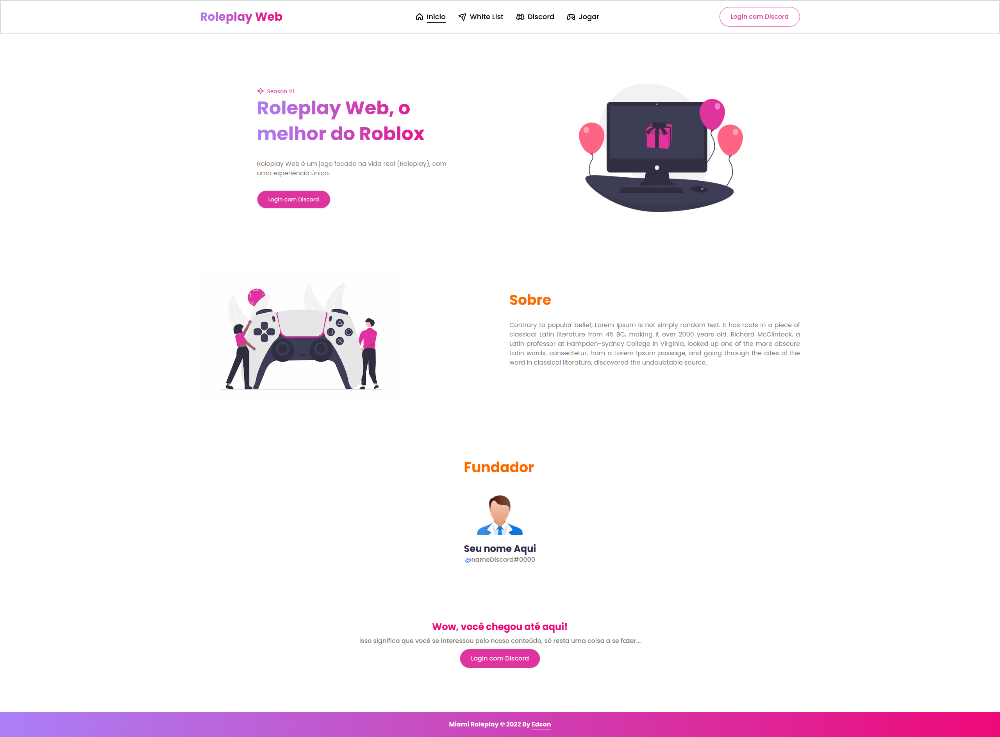

<h1>
    
</h1>

<h1>
    
</h1>

### 🧾 Sobre

<p>Esse projeto foi desenvolvido por <a href="https://github.com/edsonjaguiar" title="Github User" target="_blank">Edson</a>. O projeto é um site simples que mostra a apresentação de um jogo criado na plataforma do <a href="https://www.roblox.com/" title="Roblox Game" target="_blank">Roblox</a>, onde também o usuário responderá às perguntas da White List. Além disso, as respostas das perguntas serão enviadas para um grupo do Discord através de seu Webhook.</p>

---

### 🚀 Tecnologias utilizadas

-   React
-   Next
-   Next-auth
-   TypeScript
-   Tailwindcss
-   Husky
-   Lint-staged
-   Clsx
-   Prisma ORM
-   Phosphor-react
-   Headless-ui
-   Axios

---

### 〽️ Getting started

```zsh
    # Clonando o repositório em sua máquina
    $ git clone https://github.com/edsonjaguiar/roleplay-web

    # Acessando o repositório
    $ cd roleplay-web

    # Instalando as dependências
    $ yarn

    # Iniciando o server
    $ yarn dev
```
